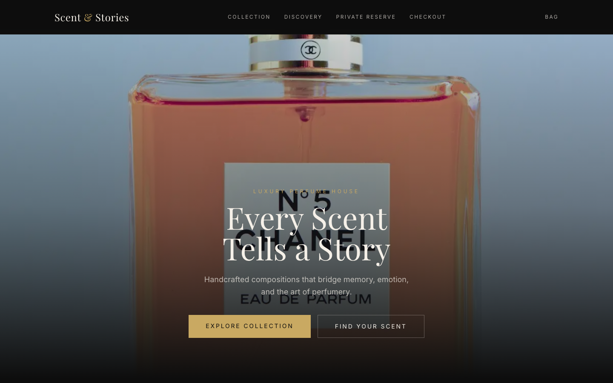
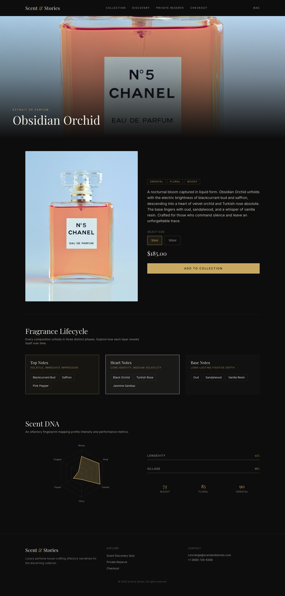
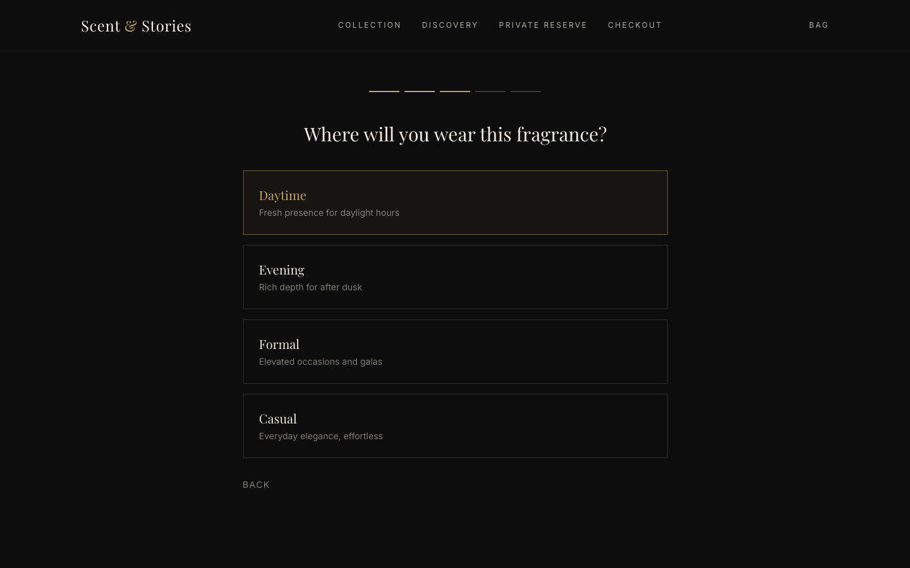
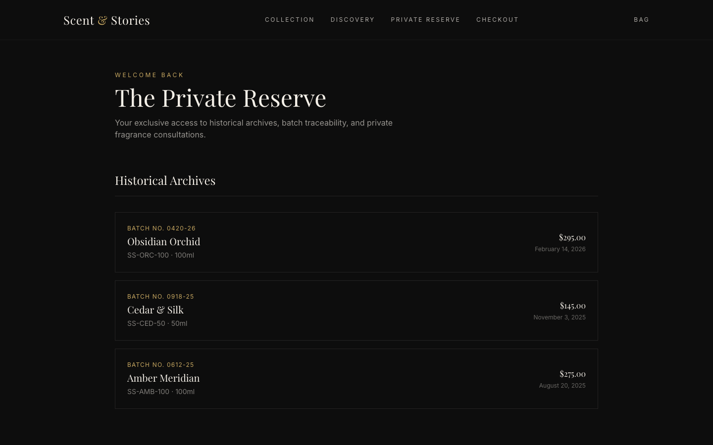
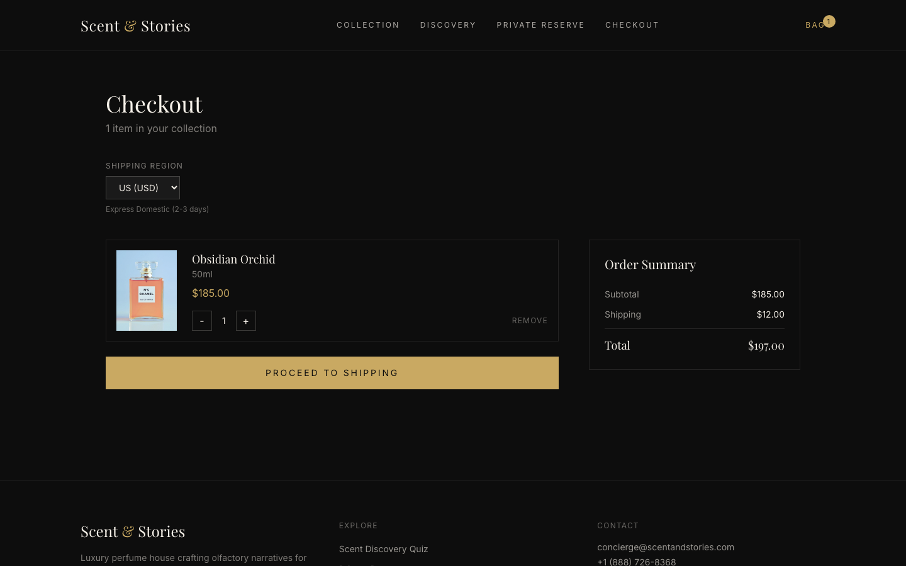
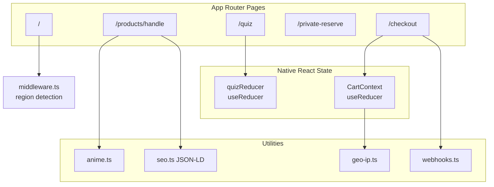

<div align="center">

# Scent & Stories

**Luxury e-commerce platform for a premium perfume brand**

Editorial storytelling, performance engineering, and native React architecture — built as a portfolio-grade direct-to-consumer storefront.

[](https://github.com/Mahnoor-Zaffar/scent-stories-ecommerce/actions/workflows/ci.yml)


[Live Demo](#live-demo) · [Features](#features) · [Quick Start](#quick-start) · [Case Study](./docs/CASE_STUDY.md) · [Deploy](./docs/DEPLOYMENT.md)

<br />



*Homepage — full-bleed hero, signature collection, and guided discovery CTA*

</div>

---

## Live Demo

| | |
|---|---|
| **Production** | Deploy via [Vercel](https://vercel.com/new) — see [Deployment Guide](./docs/DEPLOYMENT.md) |
| **Repository** | [github.com/Mahnoor-Zaffar/scent-stories-ecommerce](https://github.com/Mahnoor-Zaffar/scent-stories-ecommerce) |
| **Local** | `npm install && npm run build && npm run dev` → [localhost:3000](http://localhost:3000) |

> After deploying to Vercel, replace the Production link above with your live URL.

---

## Table of Contents

- [Why This Project](#why-this-project)
- [Features](#features)
- [Screenshots](#screenshots)
- [Tech Stack](#tech-stack)
- [Architecture](#architecture)
- [Quick Start](#quick-start)
- [Testing](#testing)
- [Project Structure](#project-structure)
- [Data Schema](#data-schema)
- [Limitations and Roadmap](#limitations-and-roadmap)
- [Documentation](#documentation)
- [Author](#author)

---

## Why This Project

Most e-commerce templates sell products. **Scent & Stories sells narrative.**

This project demonstrates how a senior frontend engineer would build a luxury DTC experience:

- **Sensory PDP design** — fragrance lifecycle animations and SVG scent profiling, not generic product galleries
- **Client-side intelligence** — a weighted recommendation engine with zero backend dependency
- **Production discipline** — TypeScript strict mode, Playwright E2E, GitHub Actions CI, JSON-LD SEO
- **Intentional simplicity** — native React state (`useReducer`, Context) instead of unnecessary libraries

---

## Features

| Module | Route | What It Does |
|--------|-------|--------------|
| **Olfactory PDP** | `/products/[handle]` | Full-bleed hero video, Anime.js note lifecycle, Scent DNA radar chart |
| **Scent Quiz** | `/quiz` | 3-step `useReducer` state machine with weighted product matching |
| **Private Reserve** | `/private-reserve` | VIP archives, batch traceability, consultation booking calendar |
| **Checkout** | `/checkout` | Cart context, geo-based currency/duties, express pay UI, webhook emulation |

### Performance targets

| Metric | Target | How |
|--------|--------|-----|
| LCP | < 1.8s | Priority hero images, SSG product pages |
| FID | < 50ms | Scoped client components |
| CLS | < 0.05 | Explicit aspect ratios on all media |

### International pricing (mock geo-IP)

```
/checkout?region=GB   → GBP + 20% duties
/checkout?region=EU   → EUR + 19% duties
/checkout?region=JP   → JPY + 10% duties
```

---

## Screenshots

### Product Detail Page
Full-bleed media, editorial copy, note lifecycle breakdown, and Scent DNA visualizer.



### Scent Discovery Quiz
Client-side state machine guiding users to a signature fragrance recommendation.



### Private Reserve (VIP Portal)
Historical order archives with batch numbers and ingredient sourcing breakdowns.



### Checkout Pipeline
Multi-step checkout with regional pricing, express payment zones, and webhook event log.



<details>
<summary><strong>Regenerate screenshots</strong></summary>

```bash
npm run build
npm run start -- -p 3001 &
PLAYWRIGHT_BASE_URL=http://127.0.0.1:3001 npm run screenshots
```

Screenshots are saved to `docs/screenshots/`.

</details>

---

## Tech Stack

| Layer | Technology | Why |
|-------|------------|-----|
| Framework | **Next.js 15** (App Router) | SSG for PDPs, middleware, built-in SEO |
| Language | **TypeScript** | Strict catalog and checkout typing |
| Styling | **Tailwind CSS** | Custom obsidian / cream / gold design system |
| Animation | **Anime.js v4** | Timeline micro-interactions with explicit cleanup |
| State | **React Context + useReducer** | No Zustand — native hooks for cart and quiz |
| Testing | **Playwright** | 9 E2E tests across all critical flows |
| CI | **GitHub Actions** | Lint, build, and E2E on every push |

---

## Architecture



### Key engineering decisions

1. **Anime.js over Framer Motion** — fine-grained stagger/timeline control; every instance cleaned up in `useEffect`
2. **SSG product pages** — pre-rendered at build time for SEO and fast LCP
3. **Separate test port (3001)** — E2E runs without conflicting with `npm run dev` on 3000
4. **Mock geo-IP middleware** — region headers injected server-side, ready to swap for Vercel Edge geo

---

## Quick Start

### Prerequisites

- Node.js 20+
- npm 10+

### Install and run

```bash
git clone https://github.com/Mahnoor-Zaffar/scent-stories-ecommerce.git
cd scent-stories-ecommerce
npm install
npm run build
npm run dev
```

Open [http://localhost:3000](http://localhost:3000).

### Scripts

| Command | Description |
|---------|-------------|
| `npm run dev` | Development server (port 3000) |
| `npm run build` | Production build |
| `npm run start` | Serve production build |
| `npm run lint` | ESLint |
| `npm run test:e2e` | Playwright tests (port 3001) |
| `npm run test:e2e:dev` | Tests against dev server on 3000 |
| `npm run test:e2e:ui` | Playwright interactive UI |
| `npm run screenshots` | Regenerate README screenshots |

---

## Testing

```bash
npm run build
npm run test:e2e          # production server on port 3001
npm run test:e2e:dev        # against running dev server
```

**9 E2E tests** cover homepage navigation, full quiz flow, checkout with regional pricing, and VIP portal interactions.

If browsers are missing:

```bash
npx playwright install chromium
```

CI runs lint, build, and E2E automatically on every push to `main`.

---

## Project Structure

```
src/
├── app/                    # Next.js App Router
│   ├── products/[handle]/  # SSG product detail pages
│   ├── quiz/               # Scent discovery quiz
│   ├── checkout/           # Checkout pipeline
│   ├── private-reserve/    # VIP portal
│   └── api/webhooks/       # Post-purchase webhook emulation
├── components/
│   ├── pdp/                # FragranceLifecycle, ScentDNAVisualizer
│   ├── quiz/               # ScentQuiz
│   ├── checkout/           # CheckoutPipeline
│   └── vip/                # PrivateReserveDashboard
├── context/CartContext.tsx # Cart + checkout state
├── lib/                    # geo-ip, quiz-engine, webhooks, seo, anime
├── data/                   # Mock catalog (3 fragrances)
└── middleware.ts           # Mock geo-IP region headers
```

---

## Data Schema

```typescript
interface Product {
  id: string;
  title: string;
  handle: string;
  description: string;
  concentration: 'Extrait de Parfum' | 'Eau de Parfum' | 'Eau de Toilette' | 'Cologne';
  olfactory_family: ('Woody' | 'Oriental' | 'Floral' | 'Citrus' | 'Chypre' | 'Fougère')[];
  top_notes: string[];
  heart_notes: string[];
  base_notes: string[];
  created_at: string;
}

interface Variant {
  id: string;
  product_id: string;
  sku: string;              // SS-[FRAGRANCE_CODE]-[SIZE_ML]
  price: number;
  compare_at_price: number | null;
  inventory_quantity: number;
  size_ml: number;
  weight_g: number;
}
```

---

## Limitations and Roadmap

| Area | Current Status | Planned (v2) |
|------|----------------|--------------|
| Payments | Apple/Google Pay UI mock | Stripe integration |
| Auth | Client-side VIP mock | Clerk or NextAuth |
| Catalog | Static TypeScript arrays | Sanity CMS |
| Geo-IP | Mock middleware | Vercel Edge headers |
| Monitoring | None | Lighthouse CI |

---

## Documentation

| Document | Description |
|----------|-------------|
| [Case Study](./docs/CASE_STUDY.md) | Portfolio narrative and talking points |
| [Deployment Guide](./docs/DEPLOYMENT.md) | Vercel setup and post-deploy checklist |
| [PRD](./PRD.md) | Original product requirements |

---

## Author

**Mahnoor Zaffar**

Full-stack portfolio project showcasing luxury UX, React architecture, and performance-conscious frontend engineering.

- GitHub: [Mahnoor-Zaffar/scent-stories-ecommerce](https://github.com/Mahnoor-Zaffar/scent-stories-ecommerce)

---

## License

[MIT](./LICENSE)
